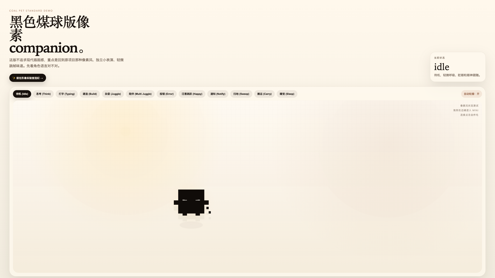
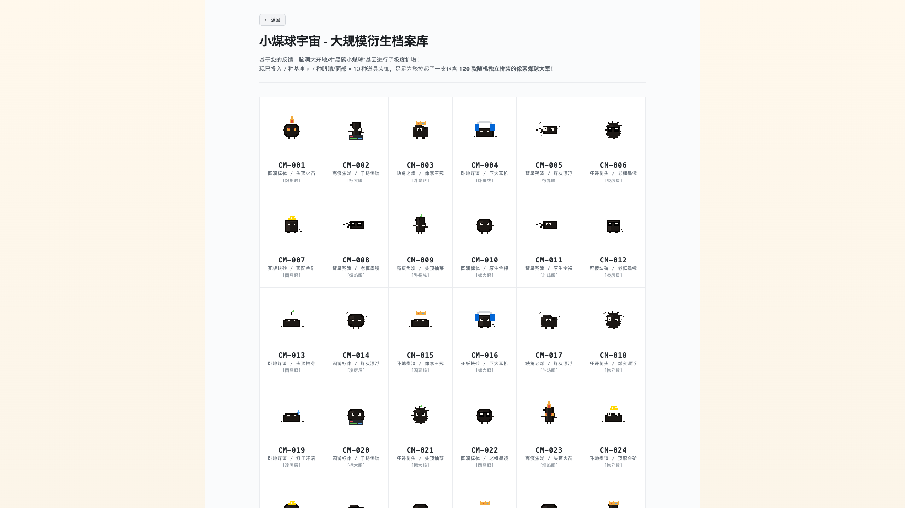

# Coal Pet (小煤球) - 反应式 (React) 重构版

这是一个基于 **React + TypeScript + Vite** 构建的像素风宠物养成类 Web 应用。该项目是对原始 Vanilla JS 版本的全面重构，旨在提供更清晰的组件化架构、严格的类型安全以及极速的开发体验。

## 🌟 核心特性

-   **像素风视觉**：回归经典的像素风格独立表演，带有一点点跳帧的艺术感。
-   **组件化架构**：将复杂的 SVG 逻辑与交互行为解耦，代码更易维护。
-   **类型安全**：全量使用 TypeScript 定义宠物的状态（PetState）与交互。
-   **响应式交互**：支持自由拖拽、眼神跟随、边缘吸附（Mini 模式）以及点击反馈（炸毛特效）。
-   **大规模衍生画廊**：基于 7x7x10 的基因库，支持随机生成 120+ 款独立拼装的煤球形象。

## 📸 功能演示

### 1. 互动主页 (Home)
包含 12 个独立的状态表演（如：打字、建造、杂耍、扫地、睡觉等）。


### 2. 煤球画廊 (Gallery)
在形象实验室中查看海量的像素煤球变体。


## 🛠️ 技术栈

-   **前端框架**: [React 19](https://react.dev/)
-   **编程语言**: [TypeScript](https://www.typescriptlang.org/)
-   **构建工具**: [Vite 6](https://vitejs.dev/)
-   **运行环境**: [Bun](https://bun.sh/)
-   **样式方案**: 原生 CSS (Vanilla CSS)

## 🚀 快速开始

### 1. 安装依赖
建议使用 Bun 获得最快速度：
```bash
bun install
```

### 2. 启动开发服务器
```bash
bun run dev
```
访问 `http://localhost:5173` 即可预览。

### 3. 运行测试
```bash
bun test
```

### 4. 生产构建
```bash
bun run build
```

## 📂 项目结构

```text
├── src/
│   ├── components/     # React 核心组件 (SVG渲染, 控制面板, 底座)
│   ├── logic/          # 核心业务逻辑与类型定义
│   │   └── __tests__/  # 逻辑单元测试
│   ├── pages/          # 页面视图 (Home, Gallery)
│   ├── styles.css      # 全局基础样式
│   └── App.tsx         # 应用入口与简易路由
├── index.html          # Vite 挂载入口
└── tsconfig.json       # TS 配置文件
```

## ⚖️ 许可证

MIT
